<div align="center">

<svg width="860" height="220" viewBox="0 0 860 220" xmlns="http://www.w3.org/2000/svg" role="img" aria-label="MicroDB hero">
  <defs>
    <linearGradient id="bg" x1="0%" y1="0%" x2="100%" y2="100%">
      <stop offset="0%" stop-color="#0f172a"/>
      <stop offset="50%" stop-color="#1e3a5f"/>
      <stop offset="100%" stop-color="#0ea5e9"/>
    </linearGradient>
    <linearGradient id="card" x1="0%" y1="0%" x2="100%" y2="0%">
      <stop offset="0%" stop-color="#38bdf8"/>
      <stop offset="100%" stop-color="#818cf8"/>
    </linearGradient>
    <filter id="glow">
      <feGaussianBlur stdDeviation="8" result="coloredBlur"/>
      <feMerge><feMergeNode in="coloredBlur"/><feMergeNode in="SourceGraphic"/></feMerge>
    </filter>
  </defs>
  <rect width="860" height="220" rx="18" fill="url(#bg)"/>
  <!-- grid -->
  <g opacity="0.08" stroke="#fff" stroke-width="0.8">
    <path d="M0 40 H860 M0 80 H860 M0 120 H860 M0 160 H860 M0 200 H860"/>
    <path d="M80 0 V220 M160 0 V220 M240 0 V220 M320 0 V220 M400 0 V220 M480 0 V220 M560 0 V220 M640 0 V220 M720 0 V220 M800 0 V220"/>
  </g>
  <g font-family="Segoe UI, Inter, sans-serif">
    <text x="36" y="58" font-size="13" font-weight="600" letter-spacing="3" fill="#7dd3fc">TRACK D — DATA &amp; STORAGE</text>
    <text x="36" y="108" font-size="54" font-weight="800" fill="#fff" letter-spacing="-1">MicroDB</text>
    <text x="36" y="138" font-size="16" fill="#cbd5e1" letter-spacing="0.3">Embedded crash-safe key-value store — Go stdlib only</text>
    <g transform="translate(36,158)">
      <rect width="118" height="28" rx="14" fill="#0ea5e9"/>
      <text x="59" y="19" text-anchor="middle" font-size="12" font-weight="700" fill="#fff">Go 1.22 • stdlib</text>
    </g>
    <g transform="translate(164,158)">
      <rect width="118" height="28" rx="14" fill="none" stroke="#38bdf8" stroke-width="1.4"/>
      <text x="59" y="19" text-anchor="middle" font-size="12" font-weight="600" fill="#7dd3fc">WAL • CRC32 • flock</text>
    </g>
    <g transform="translate(292,158)">
      <rect width="120" height="28" rx="14" fill="none" stroke="#818cf8" stroke-width="1.4"/>
      <text x="60" y="19" text-anchor="middle" font-size="12" font-weight="600" fill="#c4b5fd">Replay • Truncate</text>
    </g>
  </g>
  <!-- right card: WAL preview -->
  <g transform="translate(560,28)">
    <rect width="264" height="164" rx="14" fill="#ffffff" opacity="0.96"/>
    <text x="18" y="24" font-size="11" font-weight="700" letter-spacing="1.2" fill="#64748b">WAL FRAME</text>
    <g transform="translate(18,36)">
      <rect width="52" height="28" rx="6" fill="#0ea5e9"/><text x="26" y="18" text-anchor="middle" font-size="10" font-weight="700" fill="#fff">Len</text>
      <rect x="60" width="52" height="28" rx="6" fill="#8b5cf6"/><text x="86" y="18" text-anchor="middle" font-size="10" font-weight="700" fill="#fff">CRC</text>
      <rect x="120" width="36" height="28" rx="6" fill="#0f172a"/><text x="138" y="18" text-anchor="middle" font-size="10" font-weight="700" fill="#fff">Typ</text>
      <rect x="164" width="28" height="28" rx="6" fill="#334155"/><text x="178" y="18" text-anchor="middle" font-size="8" font-weight="700" fill="#fff">KLen</text>
      <rect x="200" width="28" height="28" rx="6" fill="#334155"/><text x="214" y="18" text-anchor="middle" font-size="8" font-weight="700" fill="#fff">VLen</text>
    </g>
    <g transform="translate(18,72)">
      <rect width="108" height="28" rx="6" fill="#e0f2fe" stroke="#7dd3fc"/><text x="54" y="18" text-anchor="middle" font-size="11" font-weight="600" fill="#0c4a6e">Key</text>
      <rect x="116" width="112" height="28" rx="6" fill="#ede9fe" stroke="#a78bfa"/><text x="172" y="18" text-anchor="middle" font-size="11" font-weight="600" fill="#4c1d95">Value</text>
    </g>
    <text x="18" y="122" font-size="10" fill="#64748b">RecordLen = 9 + KeyLen + ValLen</text>
    <text x="18" y="138" font-size="9.5" fill="#94a3b8">CRC = CRC32(Type‖KeyLen‖ValLen‖Key‖Value)</text>
    <rect x="18" y="148" width="228" height="6" rx="3" fill="#f1f5f9"/>
    <rect x="18" y="148" width="158" height="6" rx="3" fill="url(#card)"/>
  </g>
</svg>

**Deterministic crash → truncated tail → previous data recovered. No dependencies. No goroutines. Just the log.**

[](#dependency-proof)
[](#stdlibmd)
[](#3-wal-format)
[](#4-recovery-algorithm)
[](#5-locking-model)

[Architecture](#2-architecture) • [WAL Format](#3-wal-format) • [Recovery](#4-recovery-algorithm) • [Crash Demo](#8-crash-demo) • [CLI](#7-cli) • [Tests](#12-tests)

</div>

---

## Table of Contents

1. [Pitch](#1-pitch)
2. [Architecture](#2-architecture)
3. [WAL Format](#3-wal-format)
4. [Recovery Algorithm](#4-recovery-algorithm)
5. [Locking Model](#5-locking-model)
6. [Durability Policy](#6-durability-policy)
7. [CLI](#7-cli)
8. [Crash Demo](#8-crash-demo)
9. [Complexity](#9-complexity)
10. [Design Decisions & Trade-offs](#10-design-decisions--trade-offs)
11. [Prior Art](#11-prior-art)
12. [Tests](#12-tests)
13. [Dependency Proof](#13-dependency-proof)
14. [Future Work](#14-future-work)
15. [Rubric Mapping](#15-rubric-mapping)

---

## 1. Pitch

**MicroDB** is a tiny embedded key-value store that proves you understand storage engines. Not a web stack. Not a framework. Just:

* an **append-only WAL**,
* a **hash-map key directory** (Bitcask-style),
* **CRC32 per record**, bounded lengths, **replay on startup**, **truncated tail repair**, and **kernel `flock` on the DB file itself**.

> If the process dies mid-append, the next open detects the torn tail, discards it, and the previous data is intact — then you can append again immediately.

```mermaid
%%{init: {'theme':'base','themeVariables':{'primaryColor':'#e0f2fe','primaryTextColor':'#0c4a6e','lineColor':'#0ea5e9','tertiaryColor':'#f0f9ff'}}}%%
flowchart LR
  A["🌱 Seed<br/>put alpha/beta<br/><i>durable</i>"] --> B["⚡ Crash<br/>MICRODB_CRASH_AFTER_PREFIX=1<br/><i>prefix only</i>"]
  B --> C["🔍 Reopen<br/>Reader detects<br/><i>ErrCorruptTail</i>"]
  C --> D["✂️ Truncate<br/>to last good offset"]
  D --> E["✅ Recovered<br/>alpha + beta survive<br/>gamma gone"]
  E --> F["➕ Append<br/>delta after repair<br/><i>proves self-healing</i>"]

  style A fill:#ecfdf5,stroke:#10b981,stroke-width:2px
  style B fill:#fef2f2,stroke:#ef4444,stroke-width:2px
  style C fill:#fffbeb,stroke:#f59e0b,stroke-width:2px
  style D fill:#eff6ff,stroke:#3b82f6,stroke-width:2px
  style E fill:#ecfdf5,stroke:#10b981,stroke-width:2px
  style F fill:#f5f3ff,stroke:#8b5cf6,stroke-width:2px
```

---

## 2. Architecture

Single writer, single lock authority, no background goroutines.

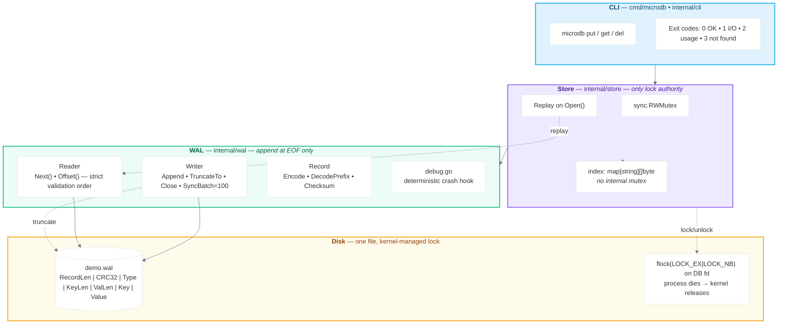

**Composition root** `cmd/microdb/main.go:1`:

```go
func main() { os.Exit(cli.Run(os.Args[1:], os.Stdout, os.Stderr)) }
```

**Ownership:**

| Worker | Owns | File |
|---|---|---|
| **A** | WAL engine | `internal/wal/record.go`, `writer.go`, `reader.go`, `debug.go` |
| **B** | Store + Index | `internal/store/store.go`, `index.go` |
| **C** | Tests | `*_test.go`, `integration` |
| **D** | Docs/Release | `README.md`, `STDLIB.md`, `Makefile`, `go.mod` |
| **E** | Lock + crash harness | `internal/lock/*`, `scripts/crash_demo.sh` |

---

## 3. WAL Format

Every record is length-prefixed, CRC-protected, and bounded.

```mermaid
%%{init: {'theme':'base','themeVariables':{'primaryColor':'#fff','lineColor':'#0ea5e9'}}}%%
flowchart LR
  subgraph Header["Byte Offsets"]
    direction LR
    H0["0"] --- H4["4"] --- H8["8"] --- H9["9"] --- H13["13"] --- H17["17"] --- HEND["…"]
  end
  Header --> L["RecordLen<br/>BE uint32<br/>4 B"]
  L --> C["CRC32<br/>BE uint32<br/>4 B"]
  C --> T["Type<br/>1 B"]
  T --> KL["KeyLen<br/>BE u32<br/>4 B"]
  KL --> VL["ValLen<br/>BE u32<br/>4 B"]
  VL --> K["Key<br/>KeyLen B"]
  K --> V["Value<br/>ValLen B"]

  style L fill:#0ea5e9,stroke:#0284c7,color:#fff
  style C fill:#8b5cf6,stroke:#7c3aed,color:#fff
  style T fill:#0f172a,stroke:#020617,color:#fff
  style KL fill:#334155,stroke:#1e293b,color:#fff
  style VL fill:#334155,stroke:#1e293b,color:#fff
  style K fill:#e0f2fe,stroke:#7dd3fc,color:#0c4a6e
  style V fill:#ede9fe,stroke:#a78bfa,color:#4c1d95
  style Header fill:#f8fafc,stroke:#cbd5e1,color:#475569
```

**Formulas:**

```
RecordLen = 9 + KeyLen + ValLen          // 1 + 4 + 4 + Key + Value
CRC span  = Type || KeyLen || ValLen || Key || Value   // RecordLen is OUTSIDE CRC
Total on disk = 8 (prefix) + RecordLen
MaxRecordSize = 16 MiB   // validated BEFORE allocation
```

| Field | Size | Encoding | Notes |
|---|---:|---|---|
| `RecordLen` | 4 B | `binary.BigEndian.Uint32` | `9 + KeyLen + ValLen`, `<= MaxRecordSize` |
| `CRC32` | 4 B | `binary.BigEndian.Uint32` | `crc32.ChecksumIEEE(body)` |
| `Type` | 1 B | `uint8` | `1 = Put`, `2 = Delete` |
| `KeyLen` | 4 B | BE | |
| `ValLen` | 4 B | BE | `0` for `Delete` tombstone |
| `Key` | `KeyLen` | raw | |
| `Value` | `ValLen` | raw | omitted for `Delete` |

Example (`put demo.wal name keshav`): `KeyLen=4`, `ValLen=6`, `RecordLen=19`, `total=27 B`.

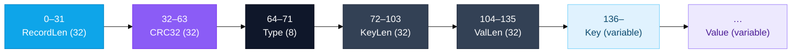

---

## 4. Recovery Algorithm

**Policy:** *Stop at the first corrupt or truncated record and discard everything after it.* For an append-only single-writer log, everything before the first bad byte remains trustworthy.

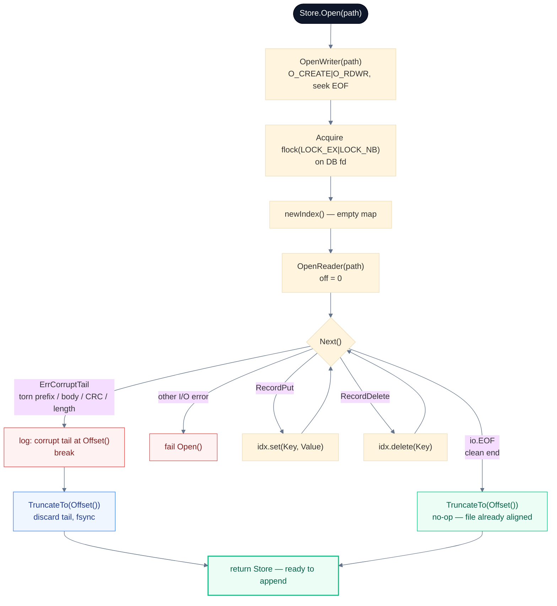

**Self-healing proof** (required sequence `Plan §21`):

```
open damaged DB → recover → truncate → put new key → close → reopen → new key exists
```

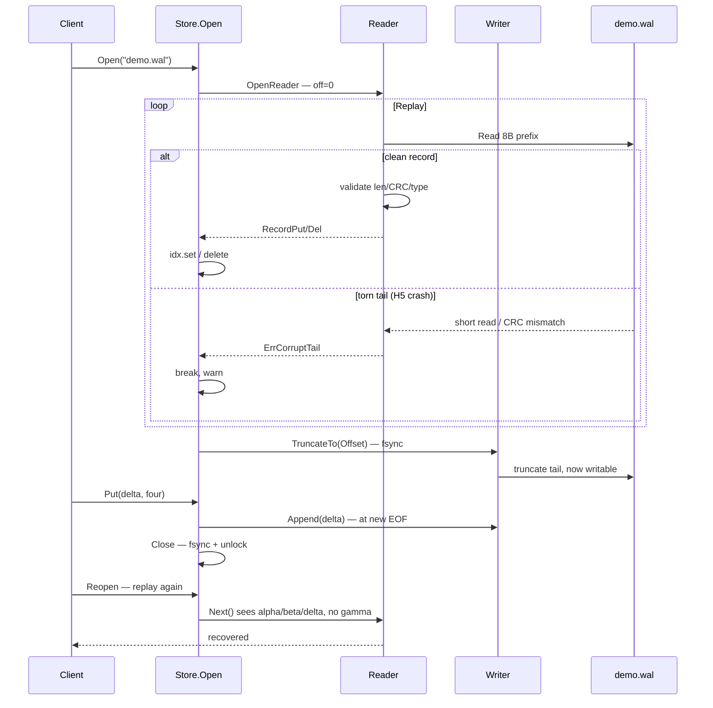

---

## 5. Locking Model

*The* correctness fix from v1: **never create `demo.wal.lock`**. A sidecar file survives `kill -9`. Instead lock the **DB file descriptor itself**.

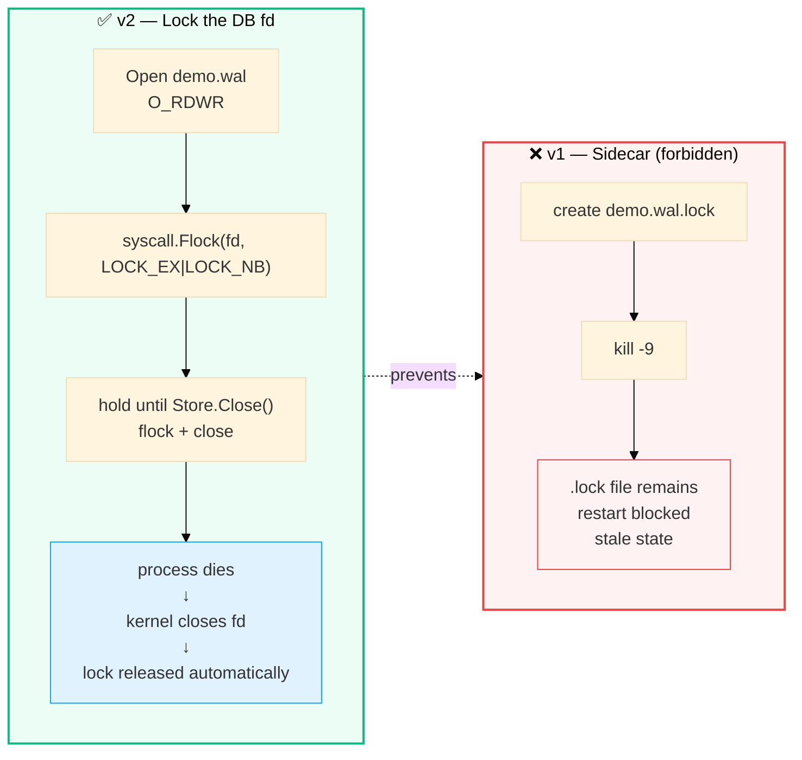

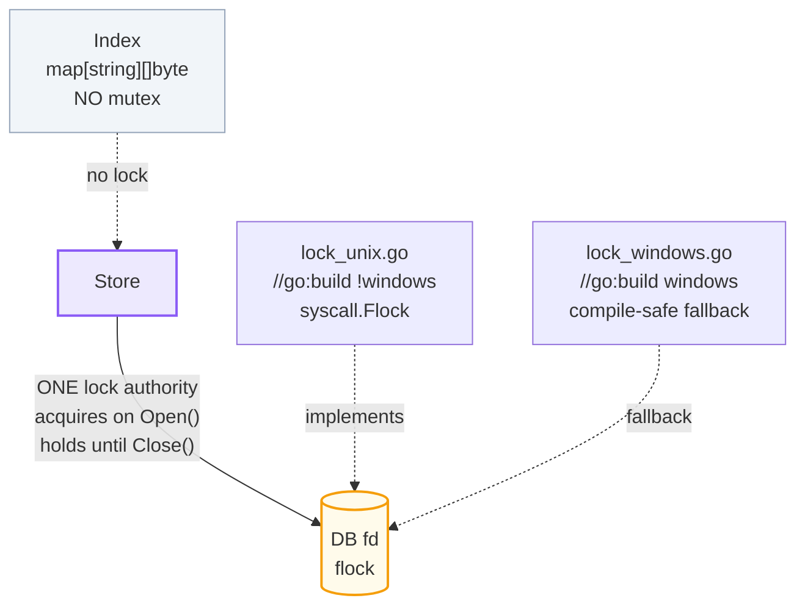

***Platform:*** `lock_unix.go` (`!windows`) uses `syscall.Flock`; `lock_windows.go` is a build-safe no-op. Strongest guarantee on the Unix demo host; Windows still compiles.

---

## 6. Durability Policy

No timer. No goroutine. Deterministic inline batching.

```mermaid
%%{init: {'theme':'base'}}%%
gantt
  title SyncBatch = 100 — deterministic fsync every 100 appends + always on Close()
  dateFormat X
  axisFormat %L
  section Appends
  write 1..99 (no sync) :0, 99
  append 100 → write + fsync :100, 101
  write 101..199 (no sync) :101, 200
  append 200 → write + fsync :200, 201
  Close() → fsync :201, 202
```

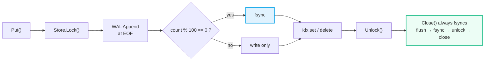

**Buffer ordering rule** `Plan §13` — never `Sync` before `Flush`:

```
write → Flush → Sync    ✅
write → Sync → Flush    ❌  (data never reaches disk)
```

Base WAL path avoids `bufio.Writer` entirely; direct `os.File.Write` so ordering is trivial.

---

## 7. CLI

Consumer-owned types, explicit exit codes, no `interface{}` leak.

```go
// internal/cli/cli.go
const ( ExitOK=0; ExitError=1; ExitUsage=2; ExitNotFound=3 )
type Stats struct{ Keys int }
func Run(args []string, stdout, stderr io.Writer) int
```

| Command | Example | Exit |
|---|---|---:|
| `put` | `microdb put demo.wal name keshav` | `0` |
| `get` | `microdb get demo.wal name` → `keshav` on stdout | `0` / `3` if missing |
| `del` | `microdb del demo.wal name` | `0` / `3` if missing |
| `dump` | `microdb dump demo.wal` | optional — cut first |

```bash
./microdb put demo.wal alpha one
./microdb get demo.wal alpha      # → one
./microdb del demo.wal alpha
./microdb get demo.wal alpha; echo $?  # → 3
```

`get` prints **only the value** to stdout; diagnostics go to stderr.

---

## 8. Crash Demo

The centerpiece — deterministic, timing-independent.

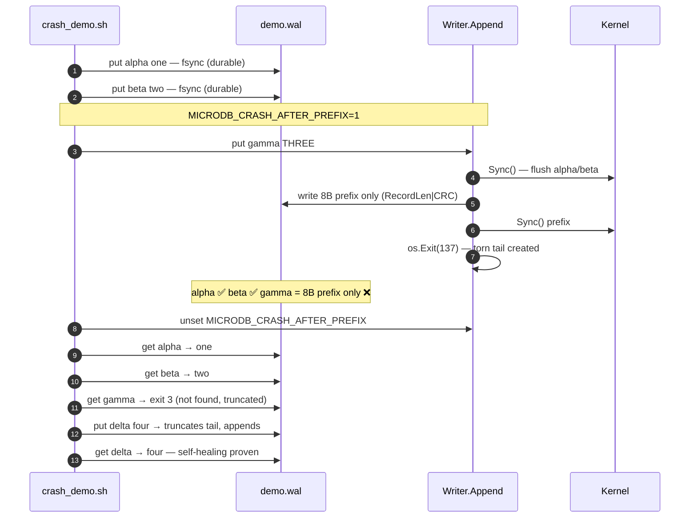

**Run it:**

```bash
go build -o microdb ./cmd/microdb
./scripts/crash_demo.sh
# or
make demo-crash
```

**What the judge sees:**

```
== Seed durable data ==
== Trigger deterministic crash ==
crashed process status: 137
== WAL tail after crash ==
00000130: 0000 0013 8f2a c4e1 ...   # 8-byte prefix, no body
== Recovery ==
alpha: one
beta: two
gamma should be missing: exit 3
== Append after recovery ==
delta: four
== Crash recovery demo passed ==
```

> Fault injection exists only for demo/QA reproducibility and is not required for ordinary operation (`internal/wal/debug.go`).

---

## 9. Complexity

No fake sophistication — just honest bounds.

| Operation | Design | Complexity |
|---|---:|---|
| `Get` | hash-map lookup | **O(1)** avg |
| `Put` | WAL append + hash update | **O(record size)** + O(1) avg |
| `Delete` | WAL append (tombstone) + hash delete | **O(record size)** + O(1) avg |
| `Replay` | sequential log scan | **O(file size)** |
| `CRC` | `crc32.ChecksumIEEE` over body | **O(record size)** |

Do not publish fake benchmark numbers. If a benchmark exists, publish measured results only.

---

## 10. Design Decisions & Trade-offs

### Strong Guarantees

* CRC-protected records + `RecordLen == 9+KeyLen+ValLen` consistency check
* `MaxRecordSize = 16 MiB` — validated **before** allocation (prevents OOM on corrupt length)
* Single writer, single lock authority (`Store` only)
* Replay + deterministic truncation + `SyncBatch` + `Close` fsync

### Deliberate Compromises

| Compromise | Why |
|---|---|
| Full key index in memory | Simplicity; Bitcask-style — fits the 3-hour hackathon |
| WAL grows without compaction | Compaction is forbidden during sprint (`Plan §4`) |
| `SyncBatch=100` creates a bounded durability window | Explicit trade-off (Redis-style); `Close` is always durable |
| No replication / transactions / MVCC | Out of scope — would dilute rubric points |

### Rejected Ideas

React, REST, ML, Docker, K8s, JWT, cloud deploy — the research mentions them, but they **do not improve the storage engine** and violate `stdlib-only` + time constraints (`Plan §2.5`).

---

## 11. Prior Art

We claim no invention — only a minimal, stdlib-only synthesis:

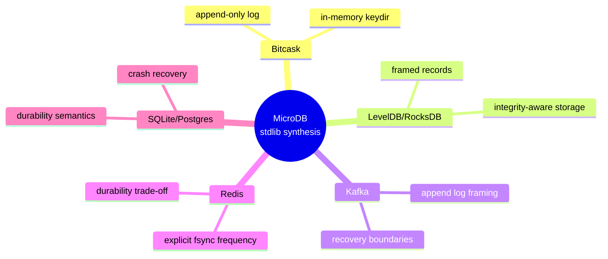

> "We took established storage-engine ideas and implemented a deliberately minimal version using only the Go standard library." — `Plan §43`

---

## 12. Tests

Pyramid adapted to a 3-hour project:

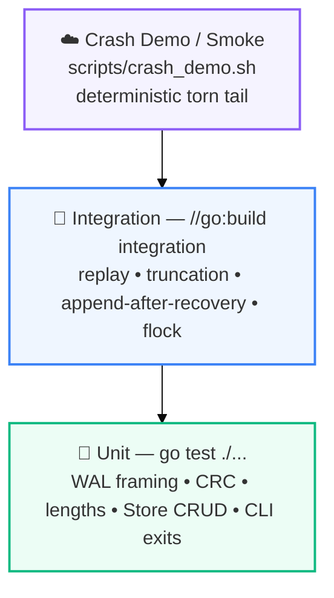

**Unit matrix** `Plan §28`:

| # | Test | Purpose |
|---:|---|---|
| 1 | `TestEncodeDecodeRoundTrip` | framing |
| 2 | `TestChecksumDetectsCorruption` | CRC |
| 3 | `TestRecordLengthConsistency` | `RecordLen == 9+K+V` |
| 4 | `TestRecordTooLargeRejected` | `MaxRecordSize` |
| 5 | `TestReaderCleanEOF` | normal EOF |
| 6 | `TestReaderTornPrefix` | partial prefix |
| 7 | `TestReaderTornBody` | partial body |
| 8 | `TestReaderUnknownRecordType` | invalid type |
| 9 | `TestPutGetDelete` | Store CRUD |
| 10 | `TestOverwriteKeepsLatestValue` | last write wins |
| 11 | `TestDeleteMissingKey` | sentinel |
| 12 | `TestCLIExitCodes` | `0/1/2/3` |

**Integration matrix** `Plan §29` (`go test -tags=integration ./...` — may use real files, reopen, truncation, subprocesses):

| Test | Purpose |
|---|---|
| `TestReplayAfterSimulatedCrash_TornTail` | centerpiece recovery |
| `TestDeleteTombstoneSurvivesReplay` | delete persists |
| `TestRecoveryTruncatesCorruptTail` | repair occurs |
| `TestReopenAfterRecoveryCanAppend` | WAL writable after repair |
| `TestLockRejectsSecondWriter` | single owner |
| `TestLockReleasedAfterProcessDeath` | no stale lock |

**Run:**

```bash
go test ./...
go test -tags=integration ./...
./scripts/crash_demo.sh
make check   # fmt-check + vet + test + integration
```

---

## 13. Dependency Proof

**Judge-facing invariant:** `GOPROXY=off` build with empty `require ()`.

```bash
cat go.mod
# module microdb
# go 1.22
# require ()

GOPROXY=off GOTOOLCHAIN=local go list -m all
# → microdb only

GOPROXY=off GOTOOLCHAIN=local go mod verify
# → all modules verified

GOPROXY=off GOTOOLCHAIN=local go build -o microdb ./cmd/microdb
# → no download, no toolchain fetch

# Clean-clone proof
git clone <public-repo> /tmp/microdb-clean
cd /tmp/microdb-clean
GOPROXY=off GOTOOLCHAIN=local go build -o microdb ./cmd/microdb
```

Also: `make deps` runs all four checks; `STDLIB.md` enumerates every imported package.

---

## 14. Future Work

Explicitly out of sprint scope — listed so the rubric sees awareness:


* compaction (garbage-collect tombstones)
* snapshots
* segment rotation
* configurable `SyncBatch` / `fsync` policies
* scan / range APIs
* metrics

Forbidden during sprint: compaction, snapshots, segment rotation, replication, networking, HTTP, multi-key transactions, MVCC, encryption, compression, external packages, background durability goroutines (`Plan §4`).

---

## 15. Rubric Mapping

| Criterion | Weight | Evidence |
|---|---:|---|
| **Functionality & Usefulness** | 35% | `put/get/del`, persistence, replay, `scripts/crash_demo.sh` |
| **Zero-Dependency Craft** | 30% | `require ()`, `GOPROXY=off` proof, `STDLIB.md` |
| **Code Quality & Idiom** | 25% | `gofmt`, `go vet`, `errors.Is`, `Store`-only lock, `SyncBatch`, tests |
| **Innovation** | 10% | deterministic `MICRODB_CRASH_AFTER_PREFIX` injection, self-healing truncate, prior-art synthesis |

**Priority rule:** crash safety beats optional features. `dump` is cut first (`Plan §5`).

---

## Repository Layout

```
microdb/
├── go.mod
├── Makefile
├── README.md
├── STDLIB.md
├── cmd/microdb/main.go
├── internal/
│   ├── wal/
│   │   ├── record.go     # Encode/DecodePrefix/Checksum — Worker A
│   │   ├── writer.go     # Append/TruncateTo/Close/SyncBatch — Worker A
│   │   ├── reader.go     # strict validation order — Worker A
│   │   └── debug.go      # deterministic crash hook — Worker A
│   ├── store/
│   │   ├── store.go      # Open/replay/Put/Get/Delete — Worker B
│   │   └── index.go      # plain map, no mutex — Worker B
│   ├── cli/
│   │   └── cli.go        # Run() with Exit codes — Worker B
│   └── lock/
│       ├── lock_unix.go     # flock on DB fd — Worker E
│       └── lock_windows.go  # compile-safe fallback
└── scripts/
    └── crash_demo.sh     # deterministic demo — Worker E
```

---

## Quick Start

```bash
# 1. Build (no network)
GOPROXY=off GOTOOLCHAIN=local go build -o microdb ./cmd/microdb

# 2. Basic CLI
./microdb put demo.wal name keshav
./microdb get demo.wal name        # → keshav
./microdb del demo.wal name
./microdb get demo.wal name; echo $?  # → 3

# 3. Crash recovery (centerpiece)
./scripts/crash_demo.sh

# 4. Quality gates
gofmt -l .                          # must be empty
go vet ./...
go test ./...
go test -tags=integration ./...
make check
```

---

<div align="center">

*Built for the 180-minute hackathon — maximize rubric points per minute, and never cut the crash demo.*

`WAL` • `CRC32` • `MaxRecordSize` • `Replay` • `Truncate` • `flock` • `SyncBatch` • `Self-healing`

</div>
