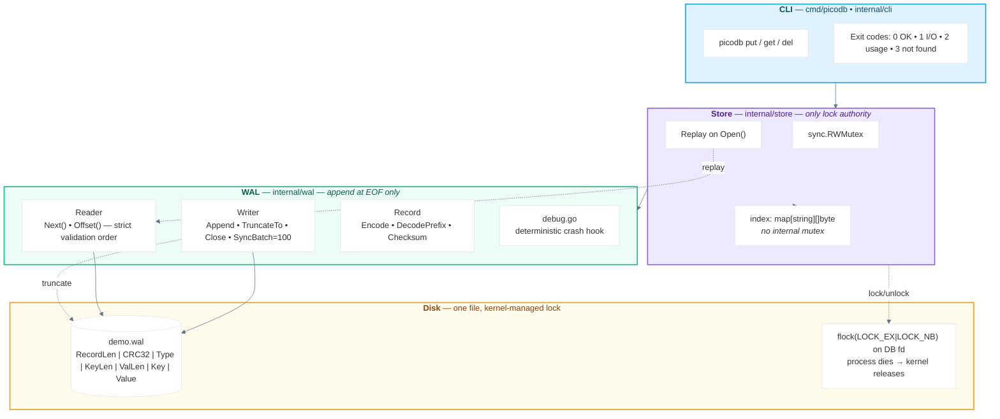
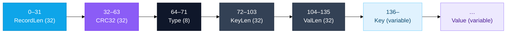
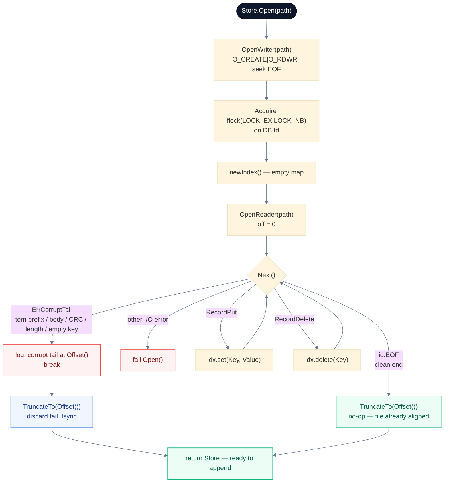
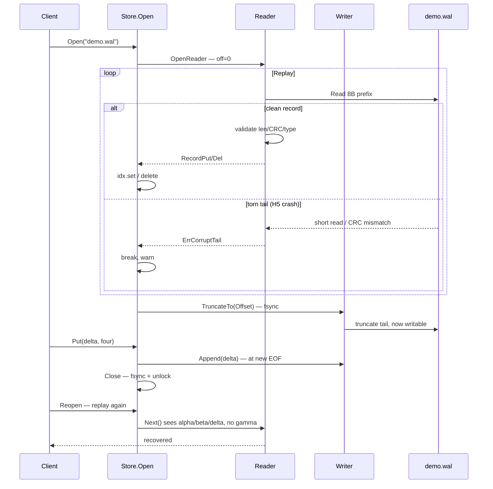
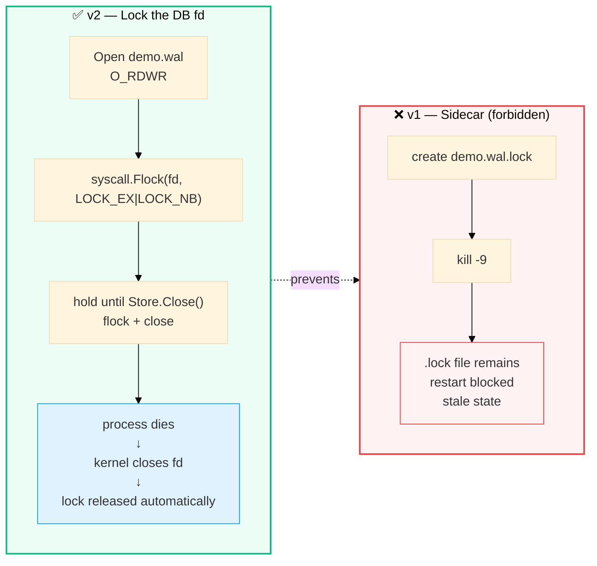
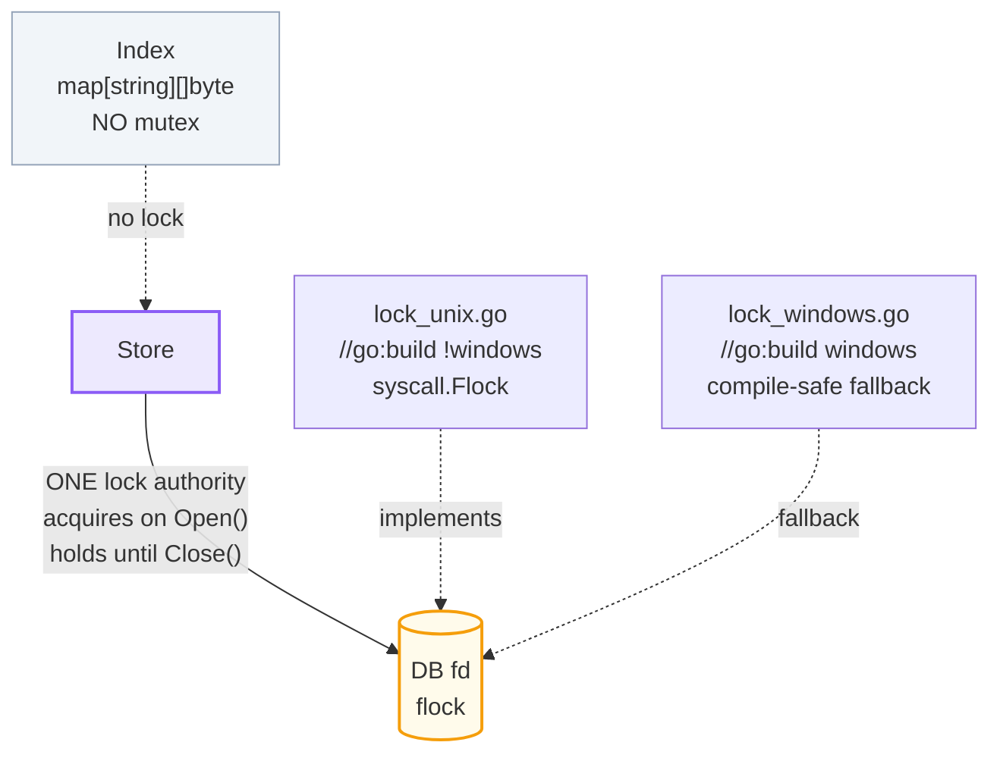
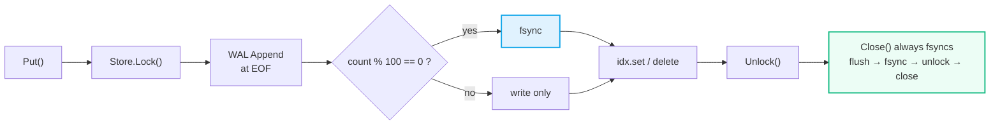

# Architecture & Core Design

> One writer. One lock holder. No goroutines, no timers, no channels.

The store owns the lock. The WAL owns the disk. The CLI owns nothing — it just calls `Store` methods and prints results.



**Composition root** `cmd/picodb/main.go:1` — the only place that wires things together:

```go
func main() { os.Exit(cli.Run(os.Args[1:], os.Stdout, os.Stderr)) }
```

**Who owns what:**

| Worker | Owns | File |
|---|---|---|
| **A** | WAL engine | `internal/wal/record.go`, `writer.go`, `reader.go`, `debug.go` |
| **B** | Store + Index | `internal/store/store.go`, `index.go` |
| **C** | Tests | `*_test.go`, `integration` |
| **D** | Docs/Release | `README.md`, `STDLIB.md`, `Makefile`, `go.mod` |
| **E** | Lock + crash harness | `internal/lock/*`, `scripts/crash_demo.sh` |

---

## WAL Format

Every record is length-prefixed, CRC-protected, and bounded. Corrupting a single byte anywhere in the body is caught; so is a record that claims to be larger than ~16 MB.

```mermaid
%%{init: {'theme':'base','themeVariables':{'primaryColor':'#fff','lineColor':'#0ea5e9'}}}%%
flowchart LR
  subgraph Header["Byte Offsets"]
    direction LR
    H0["0"] --- H4["4"] --- H8["8"] --- H9["9"] --- H13["13"] --- H17["17"] --- HEND["…"]
  end
  Header --> L["RecordLen<br/>BE uint32<br/>4 B"]
  L --> C["CRC32<br/>BE uint32<br/>4 B"]
  C --> T["Type<br/>1 B"]
  T --> KL["KeyLen<br/>BE u32<br/>4 B"]
  KL --> VL["ValLen<br/>BE u32<br/>4 B"]
  VL --> K["Key<br/>KeyLen B"]
  K --> V["Value<br/>ValLen B"]

  style L fill:#0ea5e9,stroke:#0284c7,color:#fff
  style C fill:#8b5cf6,stroke:#7c3aed,color:#fff
  style T fill:#0f172a,stroke:#020617,color:#fff
  style KL fill:#334155,stroke:#1e293b,color:#fff
  style VL fill:#334155,stroke:#1e293b,color:#fff
  style K fill:#e0f2fe,stroke:#7dd3fc,color:#0c4a6e
  style V fill:#ede9fe,stroke:#a78bfa,color:#4c1d95
  style Header fill:#f8fafc,stroke:#cbd5e1,color:#475569
```



**Formulas:**

```
RecordLen = 9 + KeyLen + ValLen          // 1 + 4 + 4 + Key + Value
CRC span  = Type || KeyLen || ValLen || Key || Value   // RecordLen is OUTSIDE CRC
Total on disk = 8 (prefix) + RecordLen
MaxRecordSize = 16 MiB   // validated BEFORE allocation
```

| Field | Size | Encoding | Notes |
|---|---:|---|---|
| `RecordLen` | 4 B | `binary.BigEndian.Uint32` | `9 + KeyLen + ValLen`, `<= MaxRecordSize` |
| `CRC32` | 4 B | `binary.BigEndian.Uint32` | `crc32.ChecksumIEEE(body)` |
| `Type` | 1 B | `uint8` | `1 = Put`, `2 = Delete` |
| `KeyLen` | 4 B | BE | |
| `ValLen` | 4 B | BE | `0` for `Delete` tombstone |
| `Key` | `KeyLen` | raw | |
| `Value` | `ValLen` | raw | omitted for `Delete` |

Example (`put demo.wal name keshav`): `KeyLen=4`, `ValLen=6`, `RecordLen=19`, `total=27 B`.



---

## Recovery Algorithm

**Policy:** stop at the first corrupt or truncated record and throw away everything after it. For an append-only, single-writer log, everything that precedes the first bad byte is trustworthy — so the engine trusts it and forgets the rest. A record with a zero-length key counts as corruption too: it could never have been written by the store, so the replay treats it as a torn tail and truncates.



**The one-line proof of self-healing:**

```
open damaged DB → recover → truncate → put new key → close → reopen → new key exists
```



---

## Locking Model

The single most important fix in this design: **we never create `demo.wal.lock`.** A sidecar lockfile is a lying artifact — it survives `kill -9` and blocks restarts forever. Instead, we lock the database file descriptor *itself*, so the kernel releases the lock the moment the process dies.





***Platform:*** `lock_unix.go` (`!windows`) uses `syscall.Flock` for a hard guarantee; `lock_windows.go` is a build-safe no-op so the project still compiles there. The demo host is Unix, so the invariant is real.

---

## Durability Policy

No background flusher, no timer ticks. Just a deterministic batch: fsync every 100 appends, and always on `Close()`.

```mermaid
%%{init: {'theme':'base'}}%%
gantt
  title SyncBatch = 100 — deterministic fsync every 100 appends + always on Close()
  dateFormat X
  axisFormat %L
  section Appends
  write 1..99 (no sync) :0, 99
  append 100 → write + fsync :100, 101
  write 101..199 (no sync) :101, 200
  append 200 → write + fsync :200, 201
  Close() → fsync :201, 202
```





**The ordering rule that matters** — a `Sync` is pointless if the write hasn't reached the OS buffer first:

```
write → Flush → Sync    ✅
write → Sync → Flush    ❌  (data never reaches disk)
```

The base WAL path skips `bufio.Writer` entirely and writes straight to the `os.File`, so this ordering falls out for free.
