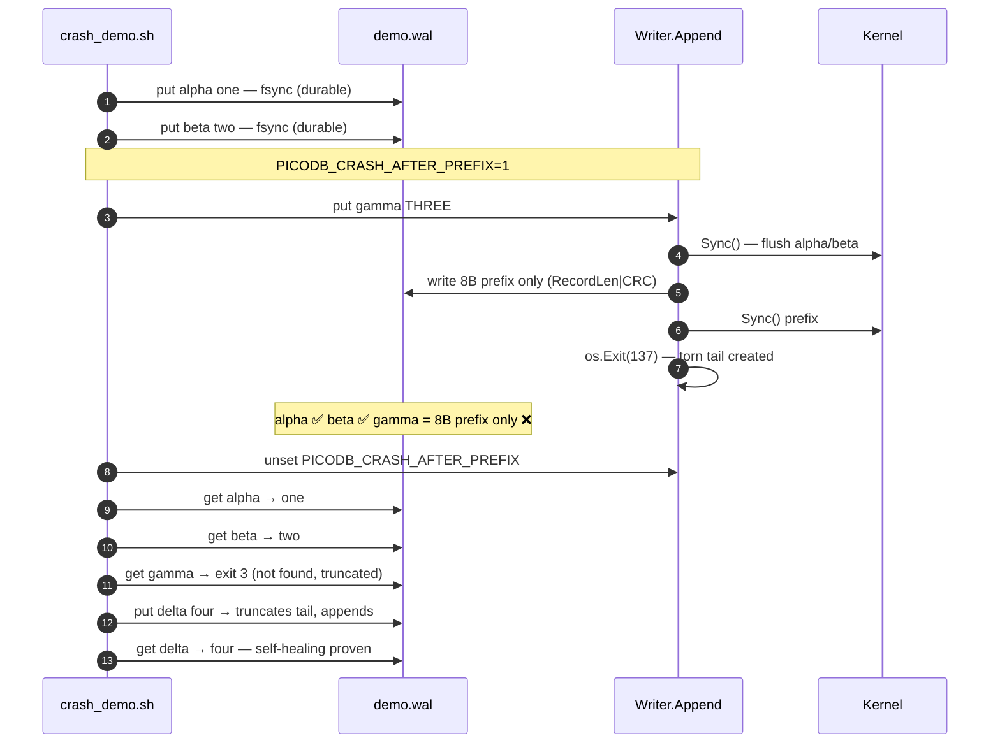

# Crash Demo

The centerpiece — and it's deterministic. No sleeps, no timing luck, no flaky tests. A fault-injection hook forces the process to exit mid-append, then we prove everything still works on the next open.

## How it works



## Run it

```bash
go build -o picodb ./cmd/picodb
./scripts/crash_demo.sh
# or
make demo-crash
```

## Output

```
== Seed durable data ==
== Trigger deterministic crash ==
crashed process status: 137
== WAL tail after crash ==
00000130: 0000 0013 8f2a c4e1 ...   # 8-byte prefix, no body
== Recovery ==
alpha: one
beta: two
gamma should be missing: exit 3
== Append after recovery ==
delta: four
== Crash recovery demo passed ==
```

> The fault-injection hook exists purely so the demo and tests are reproducible. Normal operation never touches it (`internal/wal/debug.go`). For backward compatibility it still honors the old `MICRODB_CRASH_AFTER_PREFIX` name as well as `PICODB_CRASH_AFTER_PREFIX`.
