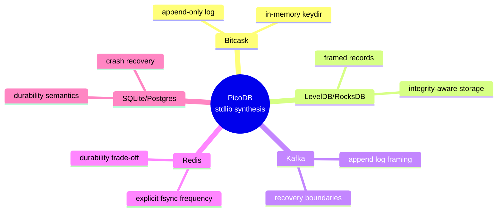
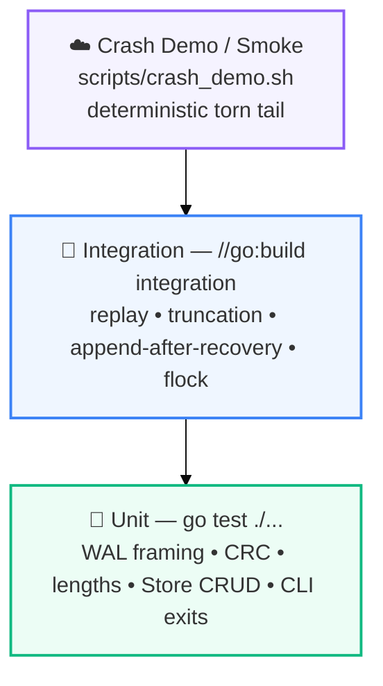

# Engineering Details

## Complexity

No invented sophistication — just honest, stated bounds.

| Operation | Design | Complexity |
|---|---:|---|
| `Get` | hash-map lookup | **O(1)** avg |
| `Put` | WAL append + hash update | **O(record size)** + O(1) avg |
| `Delete` | WAL append (tombstone) + hash delete | **O(record size)** + O(1) avg |
| `Replay` | sequential log scan | **O(file size)** |
| `CRC` | `crc32.ChecksumIEEE` over body | **O(record size)** |

> We publish complexity bounds, not fake benchmark numbers. If a benchmark ever lands in this repo, it will carry real, measured output.

---

## Design Decisions & Trade-offs

### Strong Guarantees

* CRC-protected records + `RecordLen == 9+KeyLen+ValLen` consistency check
* `MaxRecordSize = 16 MiB` — validated **before** allocation (prevents OOM on corrupt length)
* Empty keys are rejected outright by `Put`/`Get`/`Delete` (`ErrEmptyKey`) and treated as corruption at the replay boundary — so a zero-length key can never be persisted
* `Close()` syncs and closes the WAL **before** releasing the file lock — there is no window where a second writer could grab the lock while your data is still in flight
* Single writer, single lock authority (`Store` only)
* Replay + deterministic truncation + `SyncBatch` + `Close` fsync

### Good Defensive Habits

| Change | Why it matters |
|---|---|
| Ignore "invalid handle" when unlocking on Windows | The WAL closes the handle before the lock is released; the OS has already dropped the lock, so treating it as an error would be noise |
| Honor the legacy `MICRODB_CRASH_AFTER_PREFIX` env var | Keeps older crash-demo scripts working after the rename to `PICODB_CRASH_AFTER_PREFIX` |

### Deliberate Compromises

| Compromise | Why |
|---|---|
| Full key index in memory | Simplicity; Bitcask-style — fits the 3-hour hackathon |
| WAL grows without compaction | Compaction is forbidden during sprint (`Plan §4`) |
| `SyncBatch=100` creates a bounded durability window | Explicit trade-off (Redis-style); `Close` is always durable |
| No replication / transactions / MVCC | Out of scope — would dilute rubric points |

### Rejected Ideas

React, REST, ML, Docker, K8s, JWT, cloud deploy — the research mentions them, but they **do not improve the storage engine** and violate `stdlib-only` + time constraints (`Plan §2.5`).

---

## Prior Art

We're not claiming an invention — PicoDB is a deliberately lean synthesis of ideas that serious storage engines have used for decades.



> "We took established storage-engine ideas and built the smallest reasonable version of them using nothing but the Go standard library." — `Plan §43`

---

## Tests

A testing pyramid scaled to a three-hour project: one crash-demo up top, integration in the middle, and a foundation of fast unit tests.



### Unit matrix

| # | Test | Purpose |
|---:|---|---|
| 1 | `TestEncodeDecodeRoundTrip` | framing |
| 2 | `TestChecksumDetectsCorruption` | CRC |
| 3 | `TestRecordLengthConsistency` | `RecordLen == 9+K+V` |
| 4 | `TestRecordTooLargeRejected` | `MaxRecordSize` |
| 5 | `TestReaderCleanEOF` | normal EOF |
| 6 | `TestReaderTornPrefix` | partial prefix |
| 7 | `TestReaderTornBody` | partial body |
| 8 | `TestReaderUnknownRecordType` | invalid type |
| 9 | `TestPutGetDelete` | Store CRUD |
| 10 | `TestOverwriteKeepsLatestValue` | last write wins |
| 11 | `TestDeleteMissingKey` | sentinel |
| 12 | `TestCLIExitCodes` | `0/1/2/3` |

### Integration matrix

Run with `go test -tags=integration ./...` — uses real files, reopen, truncation, subprocesses:

| Test | Purpose |
|---|---|
| `TestReplayAfterSimulatedCrash_TornTail` | centerpiece recovery |
| `TestDeleteTombstoneSurvivesReplay` | delete persists |
| `TestRecoveryTruncatesCorruptTail` | repair occurs |
| `TestReopenAfterRecoveryCanAppend` | WAL writable after repair |
| `TestLockRejectsSecondWriter` | single owner |
| `TestLockReleasedAfterProcessDeath` | no stale lock |

### Run

```bash
go test ./...
go test -tags=integration ./...
./scripts/crash_demo.sh
make check   # fmt-check + vet + test + integration
```

---

## Dependency Proof

**The invariant a reviewer can verify in seconds:** a `GOPROXY=off` build with an empty `require ()` block.

```bash
cat go.mod
# module picodb
# go 1.22
# require ()

GOPROXY=off GOTOOLCHAIN=local go list -m all
# → picodb only

GOPROXY=off GOTOOLCHAIN=local go mod verify
# → all modules verified

GOPROXY=off GOTOOLCHAIN=local go build -o picodb ./cmd/picodb
# → no download, no toolchain fetch

# Clean-clone proof
git clone <public-repo> /tmp/picodb-clean
cd /tmp/picodb-clean
GOPROXY=off GOTOOLCHAIN=local go build -o picodb ./cmd/picodb
```

`make deps` runs all four checks in one shot, and `STDLIB.md` lists every single package the project imports.

---

## Rubric Mapping

| Criterion | Weight | Evidence |
|---|---:|---|
| **Functionality & Usefulness** | 35% | `put/get/del`, persistence, replay, `scripts/crash_demo.sh` |
| **Zero-Dependency Craft** | 30% | `require ()`, `GOPROXY=off` proof, `STDLIB.md` |
| **Code Quality & Idiom** | 25% | `gofmt`, `go vet`, `errors.Is`, `Store`-only lock, `SyncBatch`, tests |
| **Innovation** | 10% | deterministic `PICODB_CRASH_AFTER_PREFIX` injection, self-healing truncate, prior-art synthesis |

**Priority rule:** crash safety beats optional features. If something has to go, it's `dump` — never the crash recovery (`Plan §5`).
